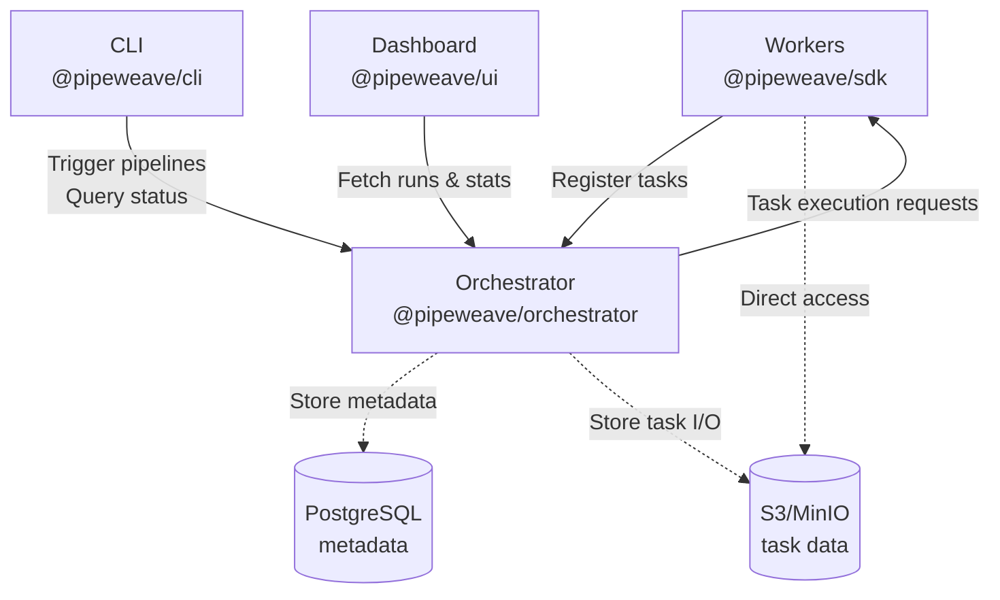
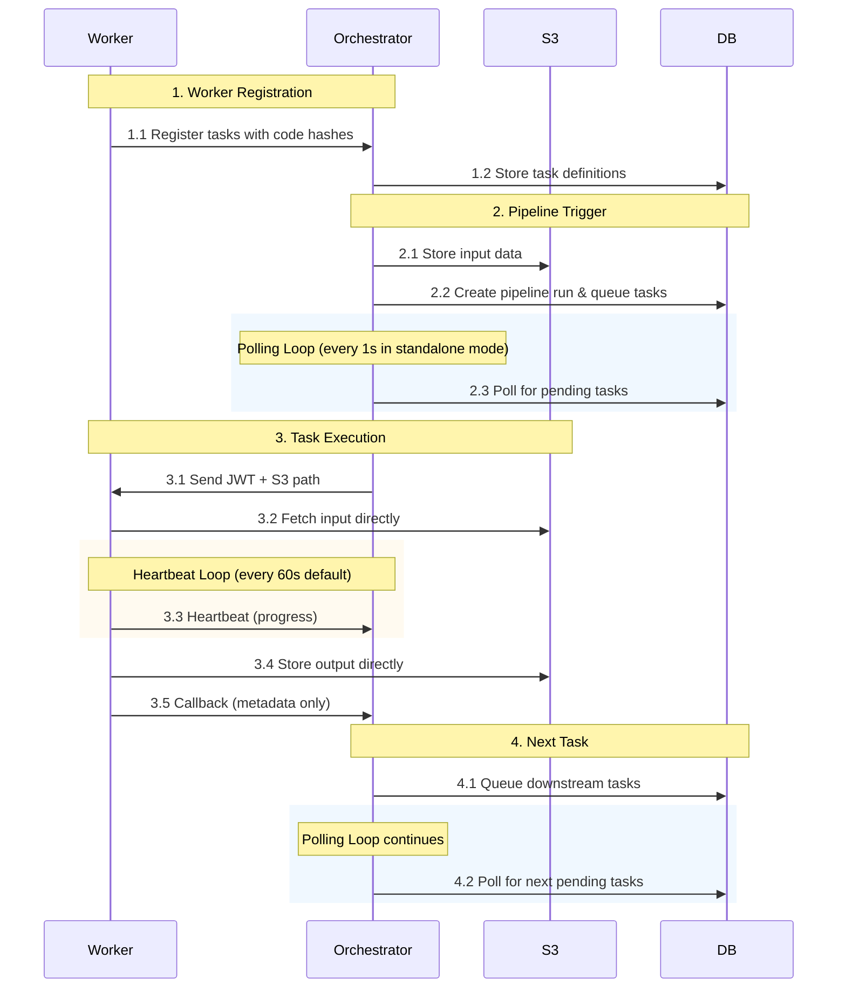

# Architecture Overview

This document explains how PipeWeave works and how its components interact.

## System Components

PipeWeave consists of several modules that work together:

1. **[@pipeweave/shared](../packages/shared)** — Shared types, constants, and utilities used by all packages
2. **[@pipeweave/sdk](../sdks/nodejs)** — Node.js SDK for creating worker services that execute tasks
3. **[@pipeweave/orchestrator](../packages/orchestrator)** — Core execution engine that manages pipelines and coordinates workers
4. **[@pipeweave/cli](../packages/cli)** — Command-line tool for triggering pipelines and managing the system
5. **[@pipeweave/ui](../packages/ui)** — Web dashboard for monitoring pipeline runs and task execution

## High-Level Architecture



### Key Concepts

- **Orchestrator**: Central coordinator that manages task execution, maintains state, and schedules work
- **Workers**: HTTP services that execute tasks and report results back to the orchestrator
- **Tasks**: Individual units of work with defined inputs, outputs, and retry policies
- **Pipelines**: DAG (Directed Acyclic Graph) of tasks that execute in sequence or parallel
- **Storage**: S3-compatible storage for task inputs, outputs, and logs (workers access directly)

## Data Flow

### Complete Task Execution Flow



### Step-by-Step Breakdown

#### 1. Worker Registration

Workers register their available tasks when they start:

```typescript
// Worker sends to orchestrator
POST /api/register
{
  "serviceId": "my-service",
  "version": "1.0.0",
  "baseUrl": "http://worker:8080",
  "tasks": [
    {
      "taskId": "process-data",
      "codeHash": "sha256:abc...",
      "config": { ... }
    }
  ]
}
```

The orchestrator:
- Stores task definitions in PostgreSQL
- Tracks code versions using SHA-256 hashes
- Increments version numbers when code changes
- Returns code change notifications to workers

#### 2. Pipeline Trigger

When a pipeline is triggered (via CLI or API):

```typescript
POST /api/pipelines/:id/trigger
{
  "input": { "userId": 123, "action": "signup" }
}
```

The orchestrator:
- Stores input data in S3 at `inputs/{runId}.json`
- Creates a `pipeline_runs` entry in PostgreSQL
- Queues entry tasks (tasks with no dependencies) as `task_runs`
- Returns the pipeline run ID

#### 3. Task Dispatch

In **standalone mode**, the orchestrator polls for pending tasks every 1 second:

```sql
SELECT * FROM task_runs
WHERE status = 'pending'
  AND scheduled_at <= NOW()
ORDER BY priority ASC, created_at ASC
LIMIT 10;
```

For each pending task:
1. Generates a JWT containing encrypted storage credentials
2. Sends task dispatch request to worker:

```typescript
POST http://worker:8080/tasks/process-data
{
  "runId": "uuid",
  "taskId": "process-data",
  "codeVersion": 2,
  "storageToken": "eyJ...", // JWT with storage creds
  "inputPath": "inputs/uuid.json",
  "upstreamRefs": { "previous-task": "outputs/uuid2.json" }
}
```

#### 4. Task Execution

The worker:
1. Decrypts the storage JWT to get S3 credentials
2. Fetches input directly from S3 using the provided path
3. Executes the task handler with the input data
4. Sends periodic heartbeats to the orchestrator (every 60s by default)
5. Stores output directly to S3 at `outputs/{runId}.json`
6. Sends completion callback to orchestrator:

```typescript
POST /api/callback/:runId
{
  "status": "success",
  "outputPath": "outputs/uuid.json",
  "outputSize": 1024,
  "duration": 5000,
  "selectedNext": ["next-task-id"] // optional programmatic routing
}
```

#### 5. Downstream Tasks

On task completion, the orchestrator:
- Updates task status to `completed` in PostgreSQL
- Determines which tasks to run next (based on `allowedNext` or `selectedNext`)
- Queues downstream tasks with references to upstream outputs
- Continues polling for the next batch of pending tasks

## Storage Architecture

### Direct Worker Access

Workers access storage directly, not through the orchestrator. This provides:
- **Better performance**: No proxy overhead
- **Scalability**: Orchestrator doesn't handle large data transfers
- **Cost efficiency**: No double bandwidth costs

### JWT-Based Credentials

The orchestrator encrypts storage credentials into a JWT token:

```typescript
// Orchestrator generates JWT
const storageToken = encryptStorageToken(
  {
    provider: "aws-s3",
    endpoint: "https://s3.amazonaws.com",
    bucket: "pipeweave-prod",
    credentials: { accessKeyId: "...", secretAccessKey: "..." }
  },
  secretKey,
  3600 // 1 hour expiration
);

// Worker decrypts JWT to access storage
const storageConfig = decryptStorageToken(storageToken, secretKey);
const s3 = createStorageProvider(storageConfig);
const input = await s3.getObject("inputs/uuid.json");
```

**Security Features:**
- AES-256-GCM encryption
- PBKDF2 key derivation (100,000 iterations)
- Time-based expiration
- Credentials never exposed in API responses

### Multi-Backend Support

PipeWeave supports multiple storage backends simultaneously:

```typescript
const orchestrator = createOrchestrator({
  storageBackends: [
    {
      id: "primary-s3",
      provider: "aws-s3",
      bucket: "pipeweave-prod",
      isDefault: true
    },
    {
      id: "local-dev",
      provider: "local",
      bucket: "data",
      credentials: { basePath: "./storage" }
    }
  ]
});
```

## Deployment Modes

### Standalone Mode

The orchestrator runs continuously with an internal polling loop:

- Polls database every 1 second for pending tasks
- Suitable for: VMs, containers, dedicated servers
- Advantages: Simple setup, real-time execution
- Configuration: `mode: "standalone"`

### Serverless Mode

The orchestrator has no internal polling. Instead, an external scheduler triggers task processing:

- External cron/scheduler calls `POST /api/tick` endpoint
- Processes a batch of pending tasks per invocation
- Suitable for: Cloud Run, Lambda, AWS Fargate
- Advantages: Pay-per-use, auto-scaling
- Configuration: `mode: "serverless"`

Example Cloud Scheduler configuration:

```yaml
# Google Cloud Scheduler
schedule: "* * * * *" # Every minute
url: https://orchestrator.example.com/api/tick
http_method: POST
```

## Reliability Features

### Heartbeat Monitoring

Workers send periodic heartbeats during task execution:

```typescript
// Heartbeat every 60 seconds
POST /api/heartbeat
{
  "runId": "uuid",
  "progress": 0.5, // optional
  "message": "Processing batch 5 of 10" // optional
}
```

If no heartbeat is received within `2 × heartbeatInterval`, the orchestrator:
- Marks the task as `timeout`
- Schedules a retry (if retries remain)
- Moves to dead letter queue (if no retries remain)

### Automatic Retries

Tasks can be configured with retry policies:

```typescript
worker.register("flaky-api-call",
  {
    retries: 3,
    retryBackoff: "exponential", // or "fixed"
    retryDelayMs: 1000,
    maxRetryDelayMs: 60000
  },
  async (ctx) => {
    // Task implementation
  }
);
```

Retry delays:
- **Fixed**: Always wait `retryDelayMs` between attempts
- **Exponential**: `retryDelayMs * 2^(attempt-1)` capped at `maxRetryDelayMs`

### Idempotency

Tasks can define idempotency keys to prevent duplicate execution:

```typescript
worker.register("charge-payment",
  {
    idempotencyKey: (input, codeVersion) =>
      `v${codeVersion}-order-${input.orderId}`,
    retries: 3
  },
  async (ctx) => {
    // Safe to retry - will return cached result if already completed
    await stripeApi.charge(ctx.input.amount);
  }
);
```

If a task with the same idempotency key completed within the TTL period:
- Orchestrator returns the cached result
- Task handler doesn't execute
- Downstream tasks still get queued

### Dead Letter Queue

After exhausting all retries, failed tasks move to the DLQ:

```typescript
GET /api/dlq
[
  {
    "dlqId": "uuid",
    "taskRunId": "uuid",
    "taskId": "process-payment",
    "error": "Payment gateway timeout",
    "attempts": 4,
    "createdAt": "2024-01-15T10:30:00Z"
  }
]

// Manual retry from DLQ
POST /api/dlq/:id/retry
{
  "taskRunId": "new-uuid"
}
```

## Pipeline Features

### DAG Execution

Pipelines are defined as directed acyclic graphs:

```typescript
worker.register("fetch-data",
  { allowedNext: ["transform", "validate"] },
  async (ctx) => { ... }
);

worker.register("transform",
  { allowedNext: ["save"] },
  async (ctx) => { ... }
);

worker.register("validate",
  { allowedNext: ["save"] },
  async (ctx) => { ... }
);

worker.register("save",
  { allowedNext: [] }, // End node
  async (ctx) => { ... }
);
```

Execution flow:
1. `fetch-data` runs first (entry task)
2. `transform` and `validate` run in parallel
3. `save` waits for both to complete (join task)

### Programmatic Routing

Tasks can dynamically choose which tasks run next:

```typescript
worker.register("router",
  { allowedNext: ["fast-path", "slow-path", "error-handler"] },
  async (ctx): Promise<TaskResult> => {
    if (ctx.input.urgent) {
      return {
        output: { routed: true },
        runNext: ["fast-path"]  // Only run fast-path
      };
    }

    if (ctx.input.hasError) {
      return {
        output: { routed: true },
        runNext: ["error-handler"]
      };
    }

    return {
      output: { routed: true },
      runNext: ["slow-path"]
    };
  }
);
```

### Context Hydration

Each task receives a fully hydrated context with all upstream outputs:

```typescript
worker.register("summarize",
  { allowedNext: [] },
  async (ctx) => {
    // Access outputs from upstream tasks
    const userData = ctx.upstream["fetch-user"].output;
    const orderData = ctx.upstream["fetch-orders"].output;

    return {
      summary: {
        user: userData.name,
        totalOrders: orderData.orders.length
      }
    };
  }
);
```

## Maintenance Mode

PipeWeave supports safe maintenance windows for database migrations:

```typescript
// Request maintenance mode
POST /api/maintenance/request
// State: running → waiting_for_maintenance

// Auto-transitions to maintenance when last task completes
// State: waiting_for_maintenance → maintenance

// Exit maintenance mode
POST /api/maintenance/exit
// State: maintenance → running
```

Health check reflects maintenance state:

```typescript
GET /health
{
  "status": "healthy",
  "canAcceptTasks": false,
  "maintenanceMode": "waiting_for_maintenance",
  "runningTasks": 3
}
```

## Project Structure

```
pipeweave/
├── packages/
│   ├── shared/          # Shared types, constants, utilities
│   ├── orchestrator/    # Core execution engine
│   ├── cli/             # Command line tool
│   └── ui/              # Next.js web dashboard
├── sdks/
│   └── nodejs/          # Node.js SDK
├── examples/            # Example projects
└── docs/                # Documentation
```

## Further Reading

- [Getting Started Guide](./getting-started.md) - Setup instructions
- [Configuration Guide](./configuration.md) - Environment variables and options
- [Deployment Guide](./deployment.md) - Production deployment
- [API Reference](../SPEC.md) - Complete API specification
- [Orchestrator Architecture](../packages/orchestrator/ARCHITECTURE.md) - Implementation details
